# WaniKani Anki Card Maker

A web app for creating Anki flashcards from WaniKani data. Search for radicals, kanji, and vocabulary, preview rich card content, and add cards to Anki with one click.

## Features

- Search WaniKani radicals, kanji, and vocabulary
- Rich card display with mnemonics, readings, audio, context sentences, and related items
- One-click add to Anki — automatically creates component cards (radicals for kanji, kanji for vocabulary)
- Verb conjugations for vocabulary cards, with the masu form on the answer side
- TTS audio for context sentences (optional, via Azure TTS)
- Dark mode support in Anki cards

## How It Works

Search for a vocabulary word to see its full breakdown — kanji composition, radicals, mnemonics, and readings. Then press "Add to Anki" and the card appears in your deck, along with cards for all component kanji and radicals.

### Search flow

<p align="center">
  <a href="docs/images/vocab-search-1.png">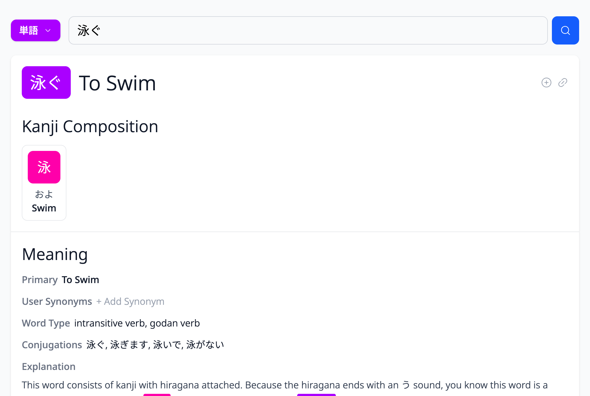</a>
  <br><em>Search for vocabulary, see kanji composition and meaning</em>
</p>

<p align="center">
  <a href="docs/images/vocab-search-2.png">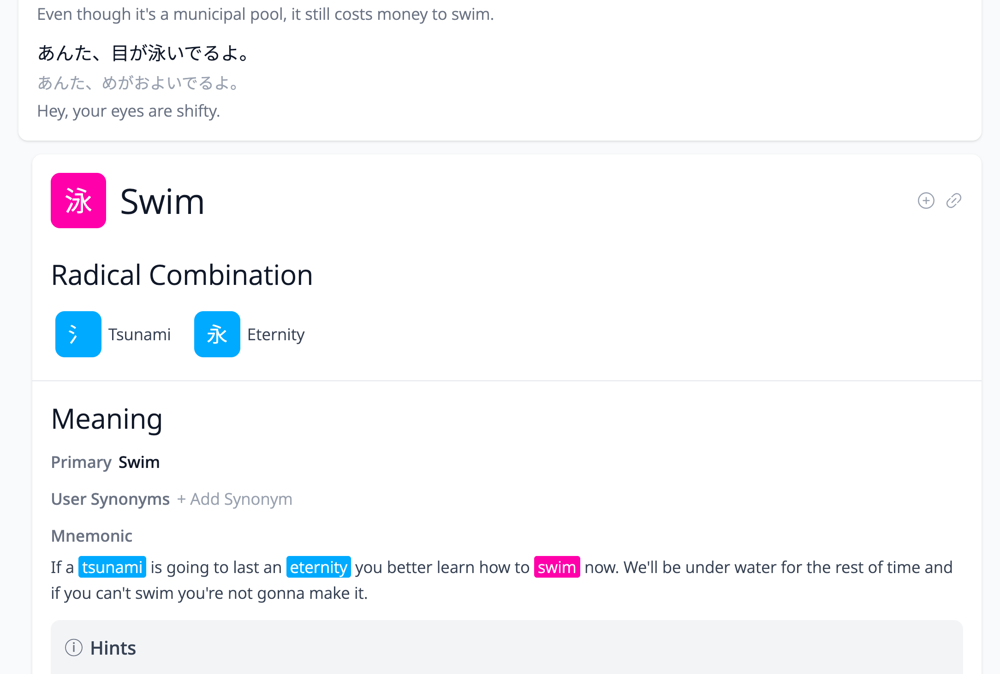</a>
  <br><em>Drill into the kanji, see its radical breakdown and mnemonic</em>
</p>

<p align="center">
  <a href="docs/images/vocab-search-3.png">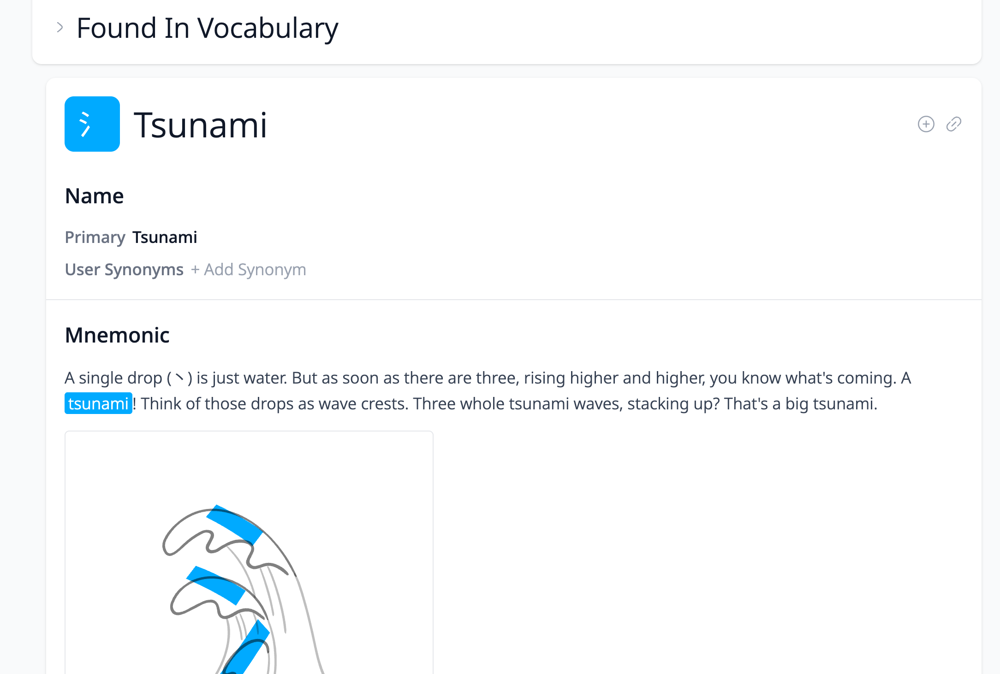</a>
  <br><em>Explore the radical with its mnemonic illustration</em>
</p>

### Anki cards

<table>
  <tr>
    <th></th>
    <th>Front</th>
    <th>Back</th>
    <th>Details</th>
  </tr>
  <tr>
    <td><strong>Vocabulary</strong></td>
    <td><a href="docs/images/vocab-card-front.png">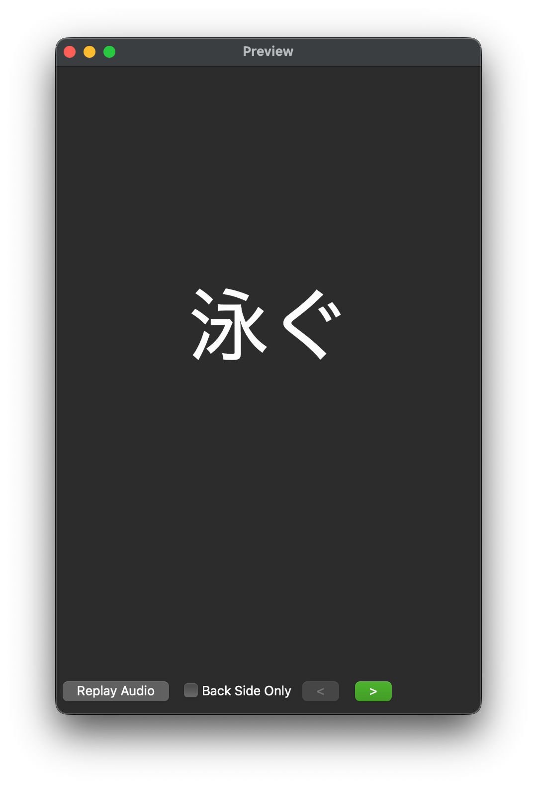</a></td>
    <td><a href="docs/images/vocab-card-back.png">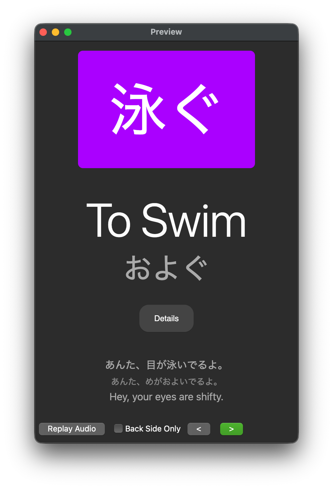</a></td>
    <td><a href="docs/images/vocab-card-details.png">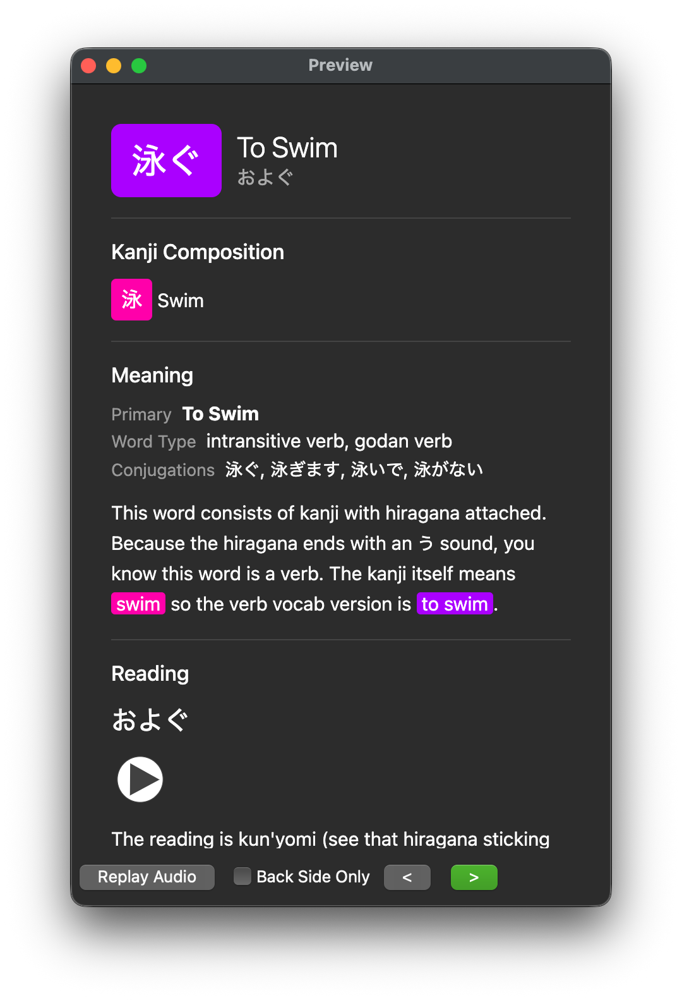</a></td>
  </tr>
  <tr>
    <td><strong>Kanji</strong></td>
    <td><a href="docs/images/kanji-card-front.png">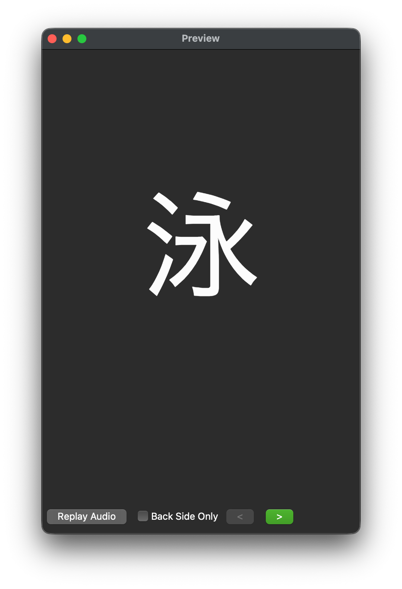</a></td>
    <td><a href="docs/images/kanji-card-back.png">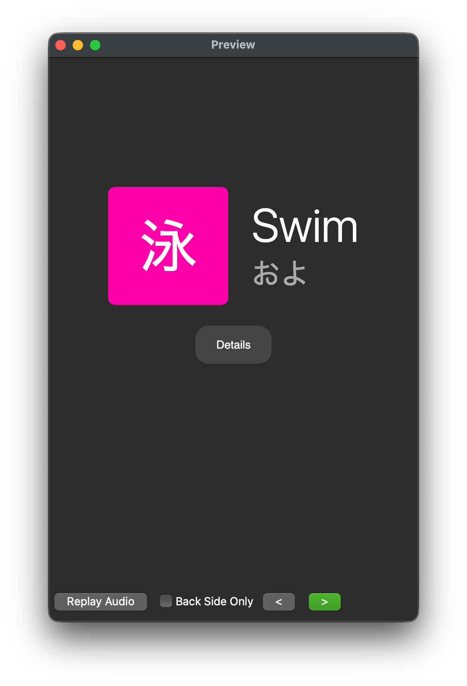</a></td>
    <td><a href="docs/images/kanji-card-details.png">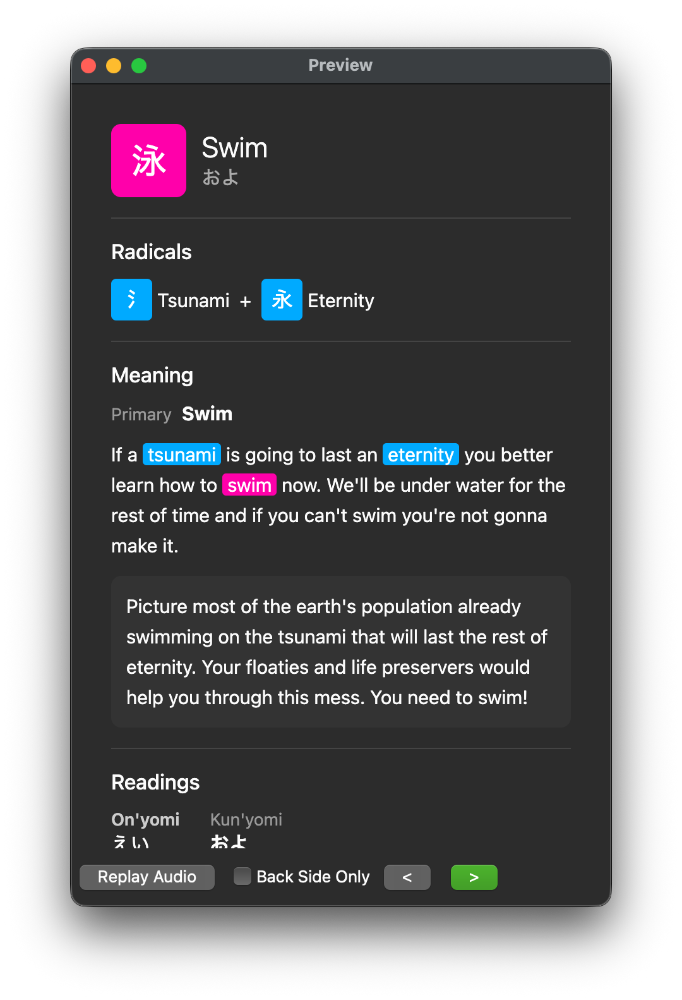</a></td>
  </tr>
  <tr>
    <td><strong>Radical</strong></td>
    <td><a href="docs/images/radical-card-front.png">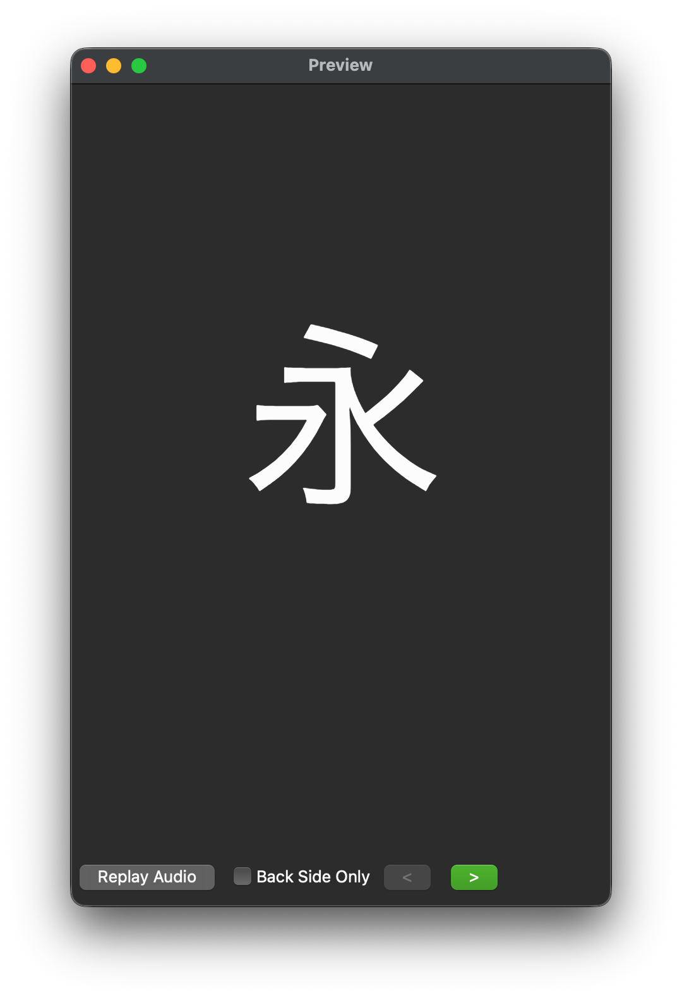</a></td>
    <td><a href="docs/images/radical-card-back.png">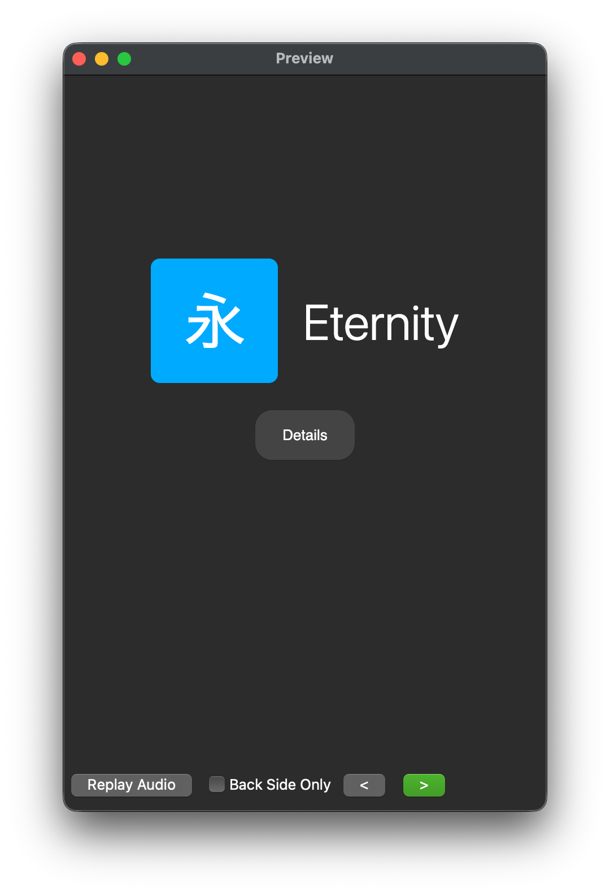</a></td>
    <td><a href="docs/images/radical-card-details.png">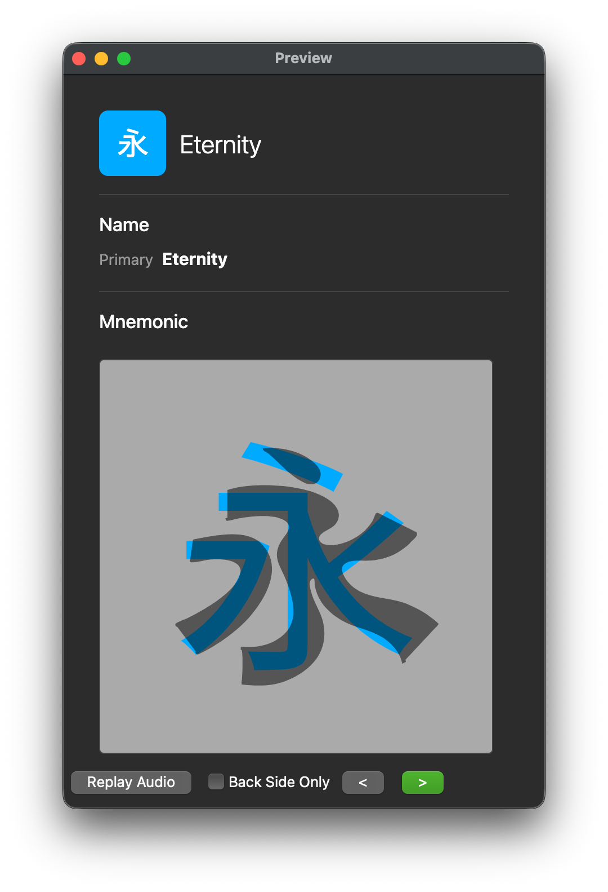</a></td>
  </tr>
</table>

## Prerequisites

- [Bun](https://bun.sh)
- [Anki](https://apps.ankiweb.net/) desktop with the [AnkiConnect](https://ankiweb.net/shared/info/2055492159) plugin
- A [WaniKani](https://www.wanikani.com/) account and API token
- (Optional) [Azure TTS](https://docs.microsoft.com/en-us/azure/cognitive-services/speech-service/overview) credentials for context sentence audio
- (Optional) An OpenAI-compatible LLM endpoint for the two generate scripts (`LLM_BASE_URL`, `LLM_API_KEY`, `LLM_MODEL` in `scripts/.env`)

## Setup

```bash
git clone https://github.com/zubko/wk-make-anki-cards.git
cd wk-make-anki-cards
bun install
```

Copy the example env files and fill in your values:

```bash
cp scripts/.env.example scripts/.env   # WaniKani API token (required), LLM settings (optional)
cp .env.example .env                   # Azure TTS for sentence audio (optional)
```

Download WaniKani data (saved to `data/userdata/`, which is gitignored):

```bash
bun run download-subjects
bun run download-study-materials
```

Create the three Anki note types and decks by hand in Anki. Nothing in this repo creates them, so a fresh install has nothing to sync to. See `docs/anki-decks-fields.md` for the three names — `Japanese Radicals`, `Japanese Kanji`, `Japanese Vocabulary`, each used for both a deck and a note type — and the fields each note type needs.

Sync the card templates to Anki once before the first add:

```bash
bun run sync-anki-templates
```

It first checks that every note type has exactly the fields its template lists. If it reports a missing field, run `bun run sync-anki-fields` in a real terminal to add it, then run `sync-anki-templates` again. If it reports an extra field, remove that field in Anki by hand.

## Usage

Start the dev server:

```bash
bun run dev
```

Open http://localhost:5173 in your browser. Search for a radical, kanji, or vocabulary item, then click "Add to Anki" to create the card (requires Anki to be running).

You can also use the REST API directly against the running server:

```bash
# Search for a vocabulary word
curl "http://localhost:5173/api/search?type=vocabulary&q=食べる"

# Add a subject to Anki by ID and type
curl -X POST "http://localhost:5173/api/add-to-anki" \
  -H "Content-Type: application/json" \
  -d '{"id": 2547, "type": "vocabulary"}'
```

## Data Scripts

| Command                              | Description                                                                                                                                                                   |
| ------------------------------------ | ----------------------------------------------------------------------------------------------------------------------------------------------------------------------------- |
| `bun run download-subjects`          | Download WaniKani subjects                                                                                                                                                    |
| `bun run download-study-materials`   | Download study materials                                                                                                                                                      |
| `bun run generate-verb-conjugations` | Generate verb conjugations via LLM. Only fills missing verbs, in batches of 20                                                                                                |
| `bun run generate-sentence-readings` | Generate kana readings for context sentences via LLM. Only fills missing items, in batches of 20                                                                              |
| `bun run sync-anki-fields`           | Add note-type fields a template lists and Anki lacks. Interactive, needs a real terminal. Changes the collection schema, so Anki then asks for a one-way sync (choose upload) |
| `bun run sync-anki-templates`        | Sync card templates to Anki. Refuses to sync when a note type has a missing or extra field                                                                                    |
| `bun run sync-anki-notes`            | Re-generate all Anki notes from current data and code, then sync to AnkiWeb once (requires dev server)                                                                        |

## Tech Stack

Bun, TypeScript, React 19, Vite, Tailwind CSS 4, Hono
